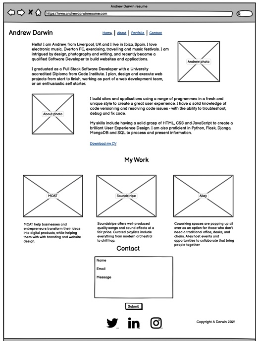
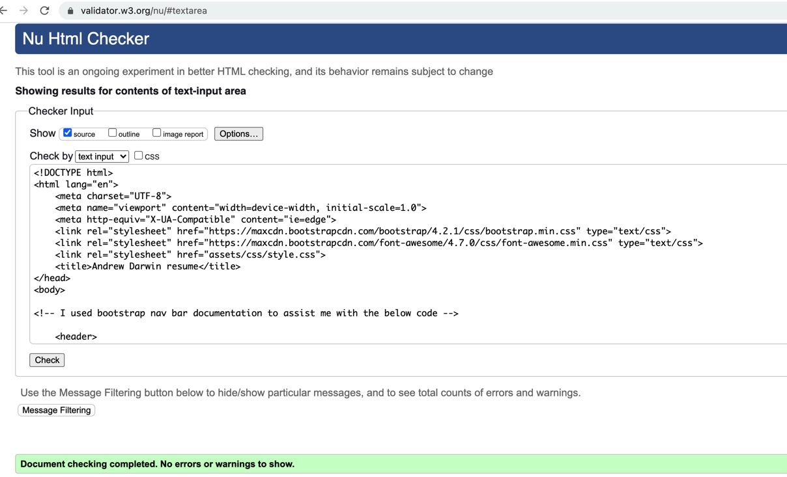
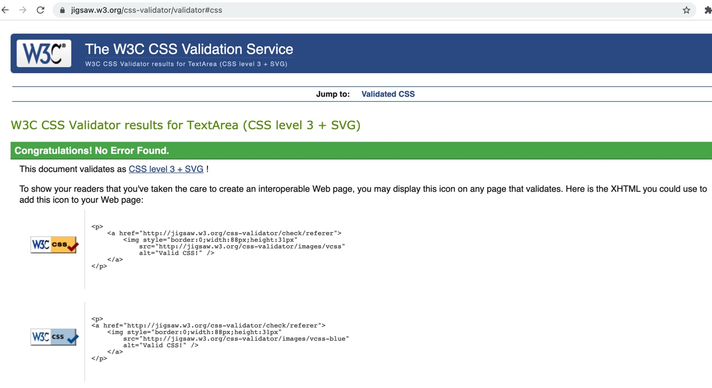
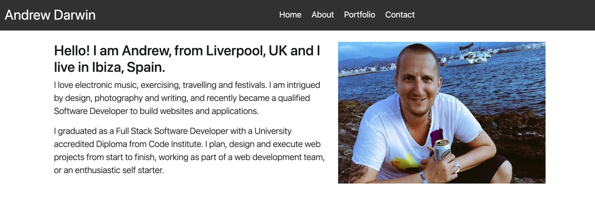
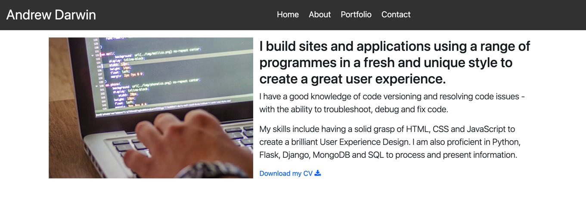
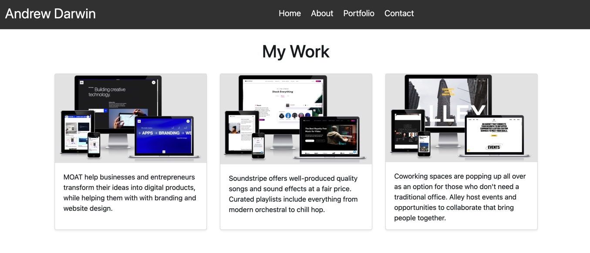
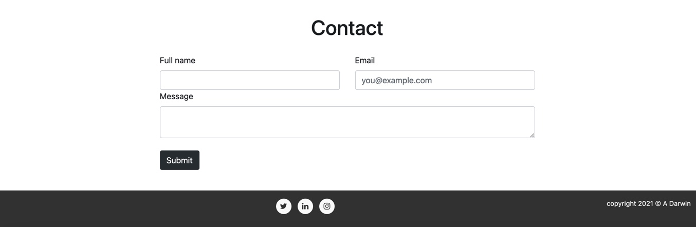

# Andrew Darwin resume

## Milestone One Project: User-Centric Frontend Development - Code Institute

Website live link - https://andrewdarwin.github.io/andrewdarwinmsproject1/

Github link - https://github.com/AndrewDarwin/andrewdarwinmsproject1

 

This is my resume website to present to prospective employers. The goal is to present myself and my skills to the best of my ability to get my first job as a Software Developer. The site highlights the skills I have learnt studying for a Full Stack Software Development diploma at Code Institute, as well as including information about myself, a portfolio of work, a link to view my full CV which provides an educational and work history, and a contact form. 

## User Experience (UX)

### User stories

* I want to learn about Andrew Darwin and his Software Development skills

* I want to be able to easily navigate throughout the site to find content

* I want to know about Andrew's education and current skillset

* I want to know where Andrew has worked in the past

* I want to take a look at Andrew's portfolio as a developer

* I want to contact Andrew

## 5 Planes UX

### Strategy

My goal was to develop an appealing portfolio website that leaves an impression with its users which will mostly be recruiters. My aim was to create a resume site with digestible information for the user. I aimed to have a nice layout and clean design - consistent in style and colour throughout.

### Scope

My aim was to provide the user with an overview of myself and my skills. I wanted to show who I am - the introduction on home page is personable, as well as offering information on my background, with the ability to contact me. 

### Structure

I structured the layout and content in an easily readable way for the user - firstly with a main navigation menu, followed by an introduction to myself. Next, the about section provides information about what I do as a Software Developer, with the option to download my full cv. The portfolio section has examples of my work (these are mock examples - not my own - to be replaced in future with my actual web designs), and finally the contact section to provide the user with an option to contact me if they choose to based on the previous sections. Each following section added to the information on the previous without over crowding the user with too much information.

### Skeleton

Here below is a wireframe of the desktop version of my site

 

### Surface

The colour scheme is white background with black text - easy to read and navigate through the site. The Header and Footer are a dark background too, I feel this contributes to the synergistic feel of the site. There is a contrast between background and foreground colours. Non-text elements have alt text attributes (or the equivalent (eg role=“img” aria-label=“”) to cater for the visually impaired.

I used the font-family: -apple-system,system-ui,BlinkMacSystemFont,"Segoe UI",Roboto,"Helvetica Neue”,Arial,sans-serif - It is used by Bootstrap (among others), which I used to design the site. I found it be to a very readable and clear font, perfect for the style of my site. 

## Features

The site features a responsive navigation menu, and a footer with social media icons linking to 3 of my social media pages - twitter, LinkedIn and Instagram. The site is a single scrolling page, with 4 separate page areas, as described below;

### Home

Home features an image (div) of myself smiling, with a nice background. The purpose of this image on arriving at the website is that I want to portray that I am a personable to the user - the kind of person that people would like to work with. As well as the image there is some engaging content describing myself and my interests, with some introductory information about my Software Developer skills.

### About

About features an image (div) of a man working on code on a computer - this is taken from Pexels, a stock image library. About also includes some information on what I do and my skills, without overwhelming the user with too much information. 

There is also a link to download my CV, providing the user with an option to read further about me and my skills/experience if they wish.

### Portfolio 

The portfolio section "My Work" are example websites only. They are not my work. All are credited in the Media section below in Credits.

In the future, as I gain further experience in coding and creating websites/apps I will display my own work here instead of the examples. 

### Contact

Contact contains a contact form, which requests the user’s name and email, and a box to leave a message. The bottom of the form contains a Submit button.

## Technologies Used

### Languages Used

* HTML

* CSS

### Frameworks, Libraries & Programs Used

* Bootstrap (including jQuery) - to assist with the design and responsiveness of the site.

* Font Awesome - for the social media icons in the footer

* Gitpod - for coding and documenting in the terminal descriptive commit messages, and pushing to GitHub.

* GitHub - to store the project after being pushed from Gitpod.

* Balsamiq - to create the wireframes during the design process for README.

## Testing

The site was tested across multiple browsers (Google Chrome, Internet Explorer, Microsoft Edge and Safari browsers) and tested on a variety of devices (Desktop, Laptop, iPhone, iPad) to ensure compatibility and responsiveness. Friends reviewed the site to discuss any user experience issues.

I used W3C Markup Validator and W3C CSS Validator Services (direct input on both) to validate the code to ensure there were no errors in the project. They both passed without any errors or warnings, screenshots below;

 

 

### Testing User Stories from User Experience (UX) Section

* I want to learn about Andrew Darwin and his Software Development skills

Upon entering the site, users are automatically greeted with a clean and easily readable navigation bar to go to the section of their choice (Home, About, Portfolio, Contact). The main points are made immediately with the home content - an introduction to who I am, and his skills as a Software Developer. From this point - the user has options to further explore and find information from the next sections on the site - about and portfolio, as well as a link to download CV, and links to my social media pages. 

 

* I want to be able to easily navigate throughout the site to find content

The site has been designed to be fluid and easy to navigate. At the top there is a clean navigation bar, each link describes what section of the site they will end up at clearly. On the Contact, after a form response is submitted, the page refreshes and the user is brought to the top of the page where the navigation bar is

* I want to know about Andrew's education and current skillset

In the About section, there is information on my current skillset, and an option to download my CV, where there is more information about my education and skillset. 

 

* I want to know where Andrew has worked in the past

In the About section, the user can download my CV which has my previous work history

* I want to take a look at Andrew's portfolio as a developer

In t he Portfolio section, there are 3 examples of my work as a developer

 

* I want to contact Andrew

There is a contact form in the Contact section. In the About section, there is a download link with my CV on, which has my email address. Finally, in the footer are my social media pages, each with the ability to contact me on. 

 

## Deployment

The project was deployed to GitHub Pages using the following steps:

1. Log in to GitHub and locate the GitHub Repository

https://github.com/AndrewDarwin/andrewdarwinmsproject1

2. At the top of the Repository, locate the "Settings" button on the menu.

3. Scroll down the Settings page until you locate the "GitHub Pages" Section.

4. Under "Source", click the dropdown called "None" and select "Master Branch".

5. The page will automatically refresh.

6. Scroll back down through the page to locate the new published site link in the "Github Pages" section.

https://andrewdarwin.github.io/andrewdarwinmsproject1/ 

## Credits

### Code

* The site was built using Bootstrap. I used Bootstrap documentation to help me construct various parts of my code;

https://getbootstrap.com/docs/4.0/components/navbar/ 

https://getbootstrap.com/docs/4.3/layout/grid/ 

https://getbootstrap.com/docs/4.4/components/card/ 

https://getbootstrap.com/docs/5.0/forms/layout/ 

* I also used some other bootstrap related sites to aid me with my code;

https://stackoverflow.com/questions/19733447/bootstrap-navbar-with-left-center-or-right-aligned-items 

https://stackoverflow.com/questions/41513463/bootstrap-4-align-navbar-items-to-the-right 

https://mdbootstrap.com/docs/b4/jquery/navigation/navs/ 

https://mdbootstrap.com/docs/standard/navigation/footer/ 

* I used https://www.w3schools.com/css/css3_colors.asp for CSS color code

* I also used Code Institute course material to assist me in writing code

### Content

All content was written by myself..

### Media

* I own the photo of myself on the home page, whilst the photo of the computer with code is taken from Pexels, a stock image library. 

* The portfolio section "My Work" are example websites only. They are not my work. They are taken from an article "https://webflow.com/blog/business-website-examples" - I used a screenshot image for each of the 3 examples from http://ami.responsivedesign.is/# for each website - https://www.studiomoat.com/, https://www.soundstripe.com/ and https://www.alley.com/

* I used https://techsini.com/multi-mockup/ for the site mockup at the top of README.
 
### Acknowledgements

Thanks to my Mentor Antonio for continuous helpful feedback.
